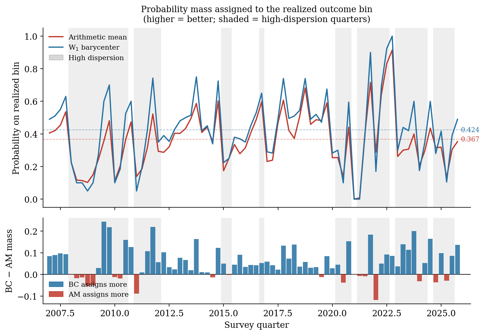

# Robust Aggregation of Expert Probability Forecasts via Wasserstein Barycenters

> Danielson, A.J. and Amini, A.A. (2026). "Robust Aggregation of Expert Probability Forecasts via Wasserstein Barycenters." *Journal of Forecasting* (submitted).

The **Wasserstein barycenter** is a robust alternative to the arithmetic mean (linear opinion pool) for aggregating expert probability forecasts over a finite outcome space. Rather than averaging probability vectors directly, it finds the distribution that minimizes total transport cost to the individual expert forecasts — downweighting extreme opinions through geometry rather than reweighting or trimming.

**Key results:**
- Under the indicator ground cost, the barycenter reduces to a constrained ℓ¹ problem (Theorem 1).
- For ordered outcome spaces (histogram forecasts), the W₁ barycenter has a closed-form solution: the distribution whose CDF is the component-wise median of the individual CDFs (Proposition 1).
- In a 76-quarter backtest on Survey of Professional Forecasters core CPI histograms (2007–2025), the barycenter places more probability mass on the realized outcome bin in **75% of quarters** (Wilcoxon *p* < 0.001) and achieves a significantly lower mean Ranked Probability Score (*p* = 0.005).

---



*Probability mass assigned to the realized Q4/Q4 core CPI outcome bin, quarter by quarter (2007–2025). The W₁ barycenter (blue) consistently places more mass on the correct bin than the arithmetic mean (red). Dashed lines mark sample means (BC: 0.424, AM: 0.367). Bottom panel shows the per-quarter difference; blue bars indicate quarters where the barycenter wins.*

---

## Repository structure

```
experts_barycenter/
├── ExpertsBarycenter.tex          # Main paper (wrapper + abstract)
├── DiscreteBarycenter.tex         # Paper body
├── barybib.tex                    # Bibliography
├── data/
│   ├── opioid/                    # Expert survey data (tab-separated)
│   └── spf/                       # SPF microdata (see below)
├── python/
│   ├── wbarycenter/               # Python package (barycenter solver)
│   ├── examples/                  # Replication scripts
│   ├── pyproject.toml
│   └── README.md                  # Package API reference
└── output/                        # Generated figures (git-ignored)
```

## Python package

Install from GitHub:

```bash
pip install git+https://github.com/aaronjdanielson/experts_barycenter.git#subdirectory=python
```

Or clone and install in editable mode:

```bash
git clone https://github.com/aaronjdanielson/experts_barycenter
cd experts_barycenter/python
pip install -e .
```

See [python/README.md](python/README.md) for the full API and quick-start examples.

## Replication

All scripts should be run from the **repository root**. Run in the following order:

```bash
# Theory figures
python python/examples/robustness.py               # §3 Robustness / EIF figures
python python/examples/simulations_study.py        # §4 Simulation tables and figures

# Applications
python python/examples/application.py              # §5 Opioid expert survey (unordered outcomes)
python python/examples/spf_application.py          # §6 SPF single-quarter illustration (2022:Q1)

# Historical backtest (§6.2)
python python/examples/spf_backtest.py             # Run backtest, download FRED data, save CSV
python python/examples/spf_backtest_figures.py     # Publication figures (RPS, score diff, dispersion)
python python/examples/spf_backtest_distributions.py  # Fan chart + mass-on-correct-bin figure
```

Output figures are written to `output/`.

### SPF data

The SPF application requires microdata from the Philadelphia Fed. Download
`SPFmicrodata.xlsx` from the
[Survey of Professional Forecasters](https://www.philadelphiafed.org/surveys-and-data/real-time-data-research/survey-of-professional-forecasters)
page and place it at `data/spf/SPFmicrodata.xlsx`.

### FRED API key

The backtest downloads realized core CPI from FRED. Set your API key before running `spf_backtest.py`:

```bash
export FRED_API_KEY=your_key_here
python python/examples/spf_backtest.py
```

A free API key is available at [fred.stlouisfed.org](https://fred.stlouisfed.org/docs/api/api_key.html). If no key is set, the script falls back to hardcoded historical values.

## License

MIT
